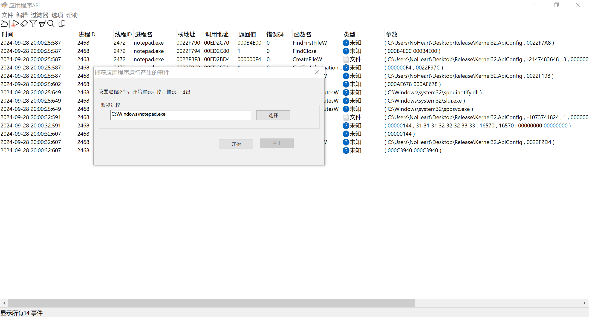
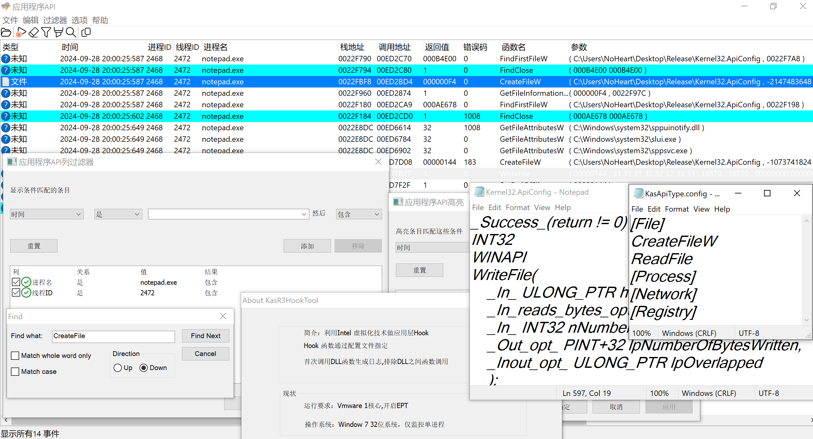
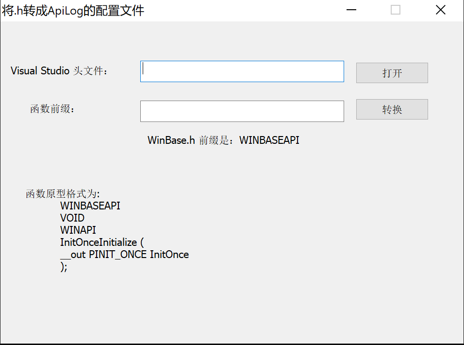

# KasR3Hook
# 应用程序Api日志程序
## 简介
使用 Intel 虚拟化特性实现应用层HOOK\
&emsp; 1.排除Dll间函数调用\
&emsp; 2.动态配置监控Api\
OS: intel cpu, Vmware 1核心 EPT开启 windows 7 32/64 sp1 , 开启测试模式，单进程

KasHookFunctionGenerate.exe 将window 头文件转成KasR3Hook的API声明的配置文件。\

